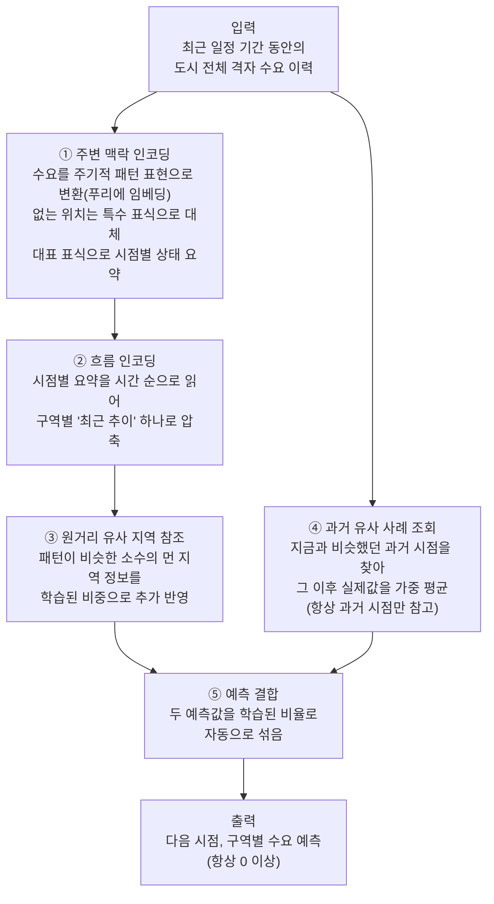

# 모델 아키텍처 개요 (발표용)

이 문서는 발표 자료 작성을 위해 모델의 동작을 개념 수준에서 정리한 것이다. 구현에 쓰인 구체적인
변수명이나 기술 스택은 다루지 않고, "어떤 정보를 어떤 방식으로 받아 어떻게 처리했는지"만 서술한다.
구현 디테일이 필요하면 `docs/MODEL_PLAN.md`를 참고한다.

## 한 줄 요약

도시를 촘촘한 격자로 나눈 뒤, 각 구역의 최근 수요 흐름을 (1) 주변 지역 맥락, (2) 시간에 따른
변화 추이, (3) 도시 내 멀리 떨어져 있지만 패턴이 비슷한 지역, (4) 과거의 유사 사례라는 네 가지
관점에서 함께 살펴보고, 이 네 관점을 종합해 다음 시점 각 구역의 수요를 예측한다.

## 입력

- 예측 시점 바로 이전의 일정 기간 동안, 도시 전체 격자 각 구역에서 관측된 수요(예: 통행량) 이력을
  입력으로 받는다.
- 한 번의 예측에 도시 전체 격자를 동시에 입력받아, 다음 시점의 전체 격자 수요를 한 번에 출력한다
  (구역을 하나씩 따로 처리하지 않는다).

## 처리 흐름

1. **주변 맥락 인코딩(공간)** — 각 구역은 자신을 둘러싼 인접 구역들의 수요 정보를 함께 참고해서,
   "이 구역이 주변과 비교했을 때 지금 어떤 상태인지"를 나타내는 하나의 요약 정보로 압축한다. 이
   요약은 매 시점마다 독립적으로 만들어진다.
   - 이때 각 인접 구역의 수요는 단순한 숫자 하나로 넣지 않고, 주기적으로 반복되는 패턴(예: 값의
     크고 작음이 일정한 리듬을 갖고 오르내리는 성질)을 표현에 자연스럽게 실을 수 있는 방식(푸리에
     임베딩)으로 변환한 뒤에 사용한다.
   - 인접 구역 중 실제로는 존재하지 않는(도시 격자 바깥에 해당하는) 위치는 "정보 없음"을 나타내는
     별도의 특수 표식으로 대체해서, 실제 수요가 0인 경우와 명확히 구분한다.
   - 이렇게 모인 인접 구역들의 정보는, 그 구역 고유의 정체성 정보가 담긴 대표 표식(요약을 대표하는
     특수 토큰) 하나로 모아져 최종 요약 정보가 된다.
2. **흐름 인코딩(시간)** — 각 구역에 대해, 1번에서 시점마다 만든 요약 정보를 시간 순서대로 이어서
   읽어들이고, 그 구역의 "최근 수요 추이"를 하나의 압축된 정보로 정리한다.
3. **원거리 유사 지역 참조** — 공간적으로 바로 인접하지는 않지만, 오랜 기간에 걸친 수요 흐름의
   패턴이 해당 구역과 유사한 소수의 다른 구역을 미리 찾아둔다. 2번에서 만든 요약 정보에, 이렇게
   찾아둔 지역들의 요약 정보를 추가로 참고해서 보강한다. 어떤 지역을 얼마나 반영할지는 미리
   고정하지 않고 학습을 통해 스스로 판단하게 하며, 사전에 파악해둔 "패턴이 얼마나 비슷한가"라는
   정보는 그 판단을 위한 참고 힌트로만 쓰인다.
4. **과거 유사 사례 조회** — 이와 별개로, 같은 구역의 과거 시점들 중 지금 입력된 패턴과 가장
   비슷했던 시점들을 찾아, 그 직후에 실제로 관측됐던 수요값들을 유사한 정도에 따라 가중 평균해서
   하나의 예측값을 만든다. 이때 항상 지금보다 앞선(과거) 시점만 참고하도록 제한해서, 아직 일어나지
   않은 미래 정보가 섞이지 않게 한다.
5. **두 예측의 결합** — 3번까지의 과정(주변 맥락 + 흐름 + 원거리 참조)으로 만든 예측값과, 4번의
   과거 유사 사례 기반 예측값을 하나로 합친다. 두 값을 어떤 비율로 섞을지도 고정하지 않고, 구역과
   상황에 따라 학습된 비율로 자동 결정되게 한다.

## 출력

- 도시 전체 모든 구역에 대해, 다음 시점의 수요를 동시에 예측한다. 수요는 음수가 될 수 없으므로
  항상 0 이상의 값으로 산출된다.

## 아키텍처 다이어그램

## 네 가지 관점 요약

| 관점 | 무엇을 보는가 | 왜 필요한가 |
|---|---|---|
| ① 주변 맥락 | 바로 인접한 구역들의 지금 상태 | 국지적으로 함께 움직이는 수요 패턴 포착 |
| ② 흐름 | 그 구역 자신의 최근 시간 변화 | 상승/하강 추세, 주기적 패턴 포착 |
| ③ 원거리 유사 지역 | 공간적으로 멀지만 패턴이 닮은 소수 지역 | ①이 놓치는, 공간적으로 떨어진 유사 지역 간 연관성 보완 |
| ④ 과거 유사 사례 | 같은 지역의 과거 중 지금과 닮은 시점들 | 학습된 일반 패턴만으로는 설명 안 되는, 그 지역 고유의 반복 사례 직접 참조 |
