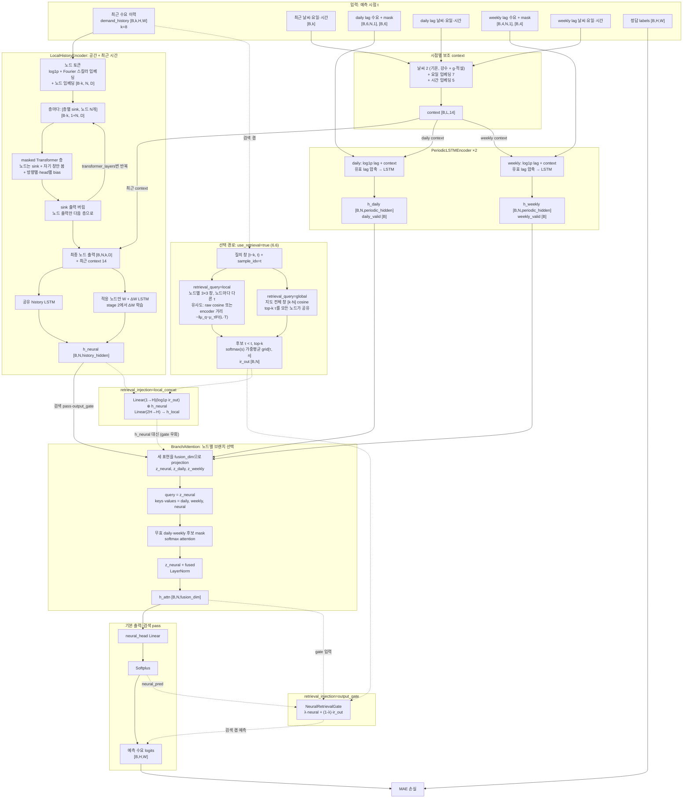

# merged 수요 예측 모델 SPEC

격자 단위 택시 수요를 1시간 앞으로 예측하는 `MergedDemandModel`과 그 학습·평가
파이프라인의 사양이다. **이 문서가 사양의 기준**이며, 사양 변경은 이 문서의 변경으로
추적한다. 코드 주석에는 변경 이력을 남기지 않는다.

각 절은 인터페이스(입출력·계약)를 먼저 적고, 구현 세부는 접힌 블록에 둔다.

## 목차

1. [데이터 흐름](#1-데이터-흐름)
2. [코드 지도](#2-코드-지도)
3. [데이터셋 `UnifiedDemandDataset`](#3-데이터셋-unifieddemanddataset)
4. [설정](#4-설정)
5. [모델 `MergedDemandModel`](#5-모델-mergeddemandmodel)
6. [모듈](#6-모듈)
7. [손실과 지표](#7-손실과-지표)
8. [학습 `train.py`](#8-학습-trainpy)
9. [평가·검증 도구](#9-평가검증-도구)
10. [실행 스크립트와 출력 경로](#10-실행-스크립트와-출력-경로)
11. [결과 보고 규약](#11-결과-보고-규약)

---

## 1. 데이터 흐름

기본 경로는 **검색 pass(`use_retrieval=false`)**다. 점선은 `model.use_retrieval=true`일 때만
실행되며, 검색 결과는 `retrieval_injection`에 따라 출력 gate(`output_gate`) 또는 local 표현
(`local_concat`) 중 한 곳에만 들어간다.



기호: `B` batch, `k=time_step=8`(입력 시간 창), `N=H×W` 노드 수, `D=d_model`,
`P=(2a+1)²` 이웃 창 셀 수(`a=local_radius`; 3×3이면 9, 5×5이면 25),
`L`은 최근 이력 `k`, daily lag 6, weekly lag 4 중 하나.

---

## 2. 코드 지도

| 경로 | 역할 |
|---|---|
| `dataset_frame/unified_demand_dataset.py` | `UnifiedDemandDataset`: 시간 격자 → 학습 샘플 |
| `models/merged/config.py` | `MergedDemandConfig` (`PretrainedConfig`) |
| `models/merged/modeling.py` | `MergedDemandModel`: 조립, 데이터 흐름, 손실 |
| `models/merged/modules/history.py` | `LocalHistoryEncoder` (+ 노드별 ΔW) |
| `models/merged/modules/embeddings.py` | `FourierScalarEmbedding` |
| `models/merged/modules/periodic.py` | `PeriodicLSTMEncoder` |
| `models/merged/modules/attention.py` | `BranchAttention` |
| `models/merged/modules/fusion.py` | `NeuralRetrievalGate` (출력 head + 검색 gate) |
| `models/merged/modules/retrieval.py` | `CausalRetrieval` (선택 경로) |
| `models/merged/losses.py`, `models/losses.py` | `build_loss`와 손실 구현 |
| `models/merged/metrics.py`, `models/metrics.py` | `compute_merged_metrics`와 공용 지표 |
| `configs/config_{ulsan,porto}.yaml` | 도시별 Hydra 루트 설정 |
| `configs/model/merged_{ulsan,porto}.yaml` | 도시별 모델 하이퍼파라미터·스위치 |
| `configs/dataset/{ulsan,porto}.yaml` | 데이터 경로·분할 |
| `train.py` / `test.py` | 학습 / 체크포인트 평가 |
| `validate_merged.py` | 구조·인과 검증 |
| `visualize_merged_node_metrics.py` | 노드별 지표 지도 |
| `run_ablation.sh`, `run_seeds.sh` | 실험 러너 |

`dataset_frame/grid_demand_dataset.py`의 `GridDemandDataset`은 export만 되어 있고 이
파이프라인에서 쓰지 않는다.

---

## 3. 데이터셋 `UnifiedDemandDataset`

```python
UnifiedDemandDataset(
    data_path, split='train', *, weather_csv_path,
    time_step=24, daily_period=24, daily_lags=6,
    weekly_period=168, weekly_lags=4, lag_radius=0,
    train_ratio=0.70, val_ratio=0.15,
)
```

입력은 `[T,H,W]` 유한·비음수 수요 격자(`.npy`)와 행 수 `T`의 날씨 CSV다. 샘플 하나는
예측 시점 `t`(절대 시간 인덱스) 하나에 대응한다.

| 키 | shape / dtype | 의미 |
|---|---|---|
| `demand_history` | `[k,H,W]` float32 | 수요 `[t-k, t)` (raw) |
| `labels` | `[H,W]` float32 | 수요 `t` |
| `sample_idx` | `[]` long | 절대 시간 인덱스 `t` |
| `weather` | `[k,3]` float32 | 기온·강수·적설 `[t-k+1, t+1)` (예측 시점 날씨 포함) |
| `hour_of_day`, `day_of_week` | `[k]` long | `[t-k, t)`의 시각(0–23)·요일(0–6) |
| `daily_demand` / `weekly_demand` | `[L,N,1]` float32 | lag 시점의 raw 수요 |
| `daily_mask` / `weekly_mask` | `[L]` bool | **True = 무효 lag** |
| `daily_weather`, `daily_hour`, `daily_day_of_week` | `[L,3]`, `[L]`, `[L]` | daily lag 시점 context |
| `weekly_weather`, `weekly_hour`, `weekly_day_of_week` | `[L,3]`, `[L]`, `[L]` | weekly lag 시점 context |

<details>
<summary>분할·lag·날씨 세부</summary>

- 분할 경계: `train_end = int(T·train_ratio)`, `val_end = int(T·(train_ratio+val_ratio))`.
  예측 시점은 train `[k, train_end)`, val `[max(k,train_end), val_end)`,
  test `[max(k,val_end), T)`. 세 split 모두 `sample_idx`는 절대 인덱스를 유지한다.
- lag: `period·i` (`i=1..count`)마다 `[-lag_radius, +lag_radius]` 오프셋을 펼치고
  양수만 남겨 **오래된 것부터** 정렬한다. `lag_radius=0`이면 정확한 배수만 쓴다.
  lag 원천 시점이 `<0`이면 수요·context를 0으로 채우고 mask를 True로 둔다.
- 날씨 CSV: cp949, 열 `기온(°C)`, `강수량(mm)`, `적설(cm)` 순서. 강수·적설 결측은 0으로
  채우고 기온 결측은 허용하지 않는다. 결과는 유한해야 한다.
- 데이터셋은 정규화하지 않는다. 수요 `log1p`와 날씨 정규화는 모델이 한다.

</details>

---

## 4. 설정

Hydra 루트 설정은 도시별로 분리한다: `python train.py --config-name config_{ulsan,porto}`
(기본 `config_ulsan`). 루트는 `dataset: <city>`, `model: merged_<city>` 그룹을 포함한다.

### 4.1 `MergedDemandConfig`

데이터 파생 필드는 `train.py`가 train 구간에서 계산해 주입하고, 나머지는
`configs/model/merged_<city>.yaml`에서 온다.

| 그룹 | 필드 | 현재 값 (Ulsan / Porto) |
|---|---|---|
| 데이터 파생 | `height`, `width`, `time_step` | 14×12 / 10×20, 8 (`configs/dataset/<city>.yaml`) |
| | `temperature_min`, `temperature_max` | train 구간 기온 최솟값·최댓값 |
| | `precipitation_max` | train 구간 `강수 + 1·적설`의 최댓값 (> 0) |
| | `node_adaptive_indices` | train 구간 평균 수요 > `node_adaptive_min_demand`인 노드 id |
| | `retrieval_grid_path`, `retrieval_train_end` | 수요 `.npy` 절대경로, `train_end` |
| local | `local_radius` | 1 (3×3) |
| | `d_model` | 16 / 64 |
| | `num_fourier_bands` | 8 |
| | `transformer_layers`, `transformer_heads`, `transformer_ffn` | 2, 4, 128 |
| | `dropout`, `attention_dropout` | 0.10, 0.0 |
| | `history_hidden` | 64 |
| periodic | `periodic_hidden` | 64 |
| fusion | `fusion_dim` | 128 |
| context | `weekday_dim`, `hour_dim` | 7, 5 |
| 검색 | `use_retrieval` | **false** |
| | `retrieval_local_radius` | 미지정 → `local_radius` |
| | `retrieval_k`, `retrieval_chunk_size`, `retrieval_scope` | 20, 256, `observed_past` |
| | `retrieval_encoder_path` | null (단독 학습 검색 encoder `encoder.pt`; 있으면 유사도를 encoder latent 거리로) |
| | `retrieval_query` | `local` (노드별 3×3 창) / `global` (지도 전체 창, 고른 시점을 모든 노드가 공유) |
| | `retrieval_injection` | `output_gate` (λ 혼합) / `local_concat` (`h_neural`에 concat, gate 우회) |
| 노드 적응 | `node_adaptive`, `node_adaptive_min_demand` | true, 0.1 |
| 손실 | `loss_type` | `mae` |
| | `loss_gamma`, `loss_eps`, `rmse_weight`, `split_threshold`, `split_high_weight` | 1.0, 0.5, 10.0, 1.0, 1.0 |

### 4.2 기능 스위치

모든 스위치는 `model.<name>=...` Hydra 오버라이드로 바꾼다. 검색을 제외한 스위치는
**0-치환**이다: 모듈은 항상 생성·실행하고 결과 텐서만 0으로 바꿔 shape과 파라미터 수를
유지한다.

| 스위치 | 기본 | false일 때 |
|---|---|---|
| `use_retrieval` | false | 검색기·raw grid를 만들지 않고 neural 예측을 그대로 출력 |
| `use_daily` / `use_weekly` | true | `h_daily` / `h_weekly`를 0으로 (valid mask는 유지) |
| `use_weather` | true | 정규화 날씨를 0으로 (train 평균에 해당) |
| `use_calendar` | true | 요일·시간 임베딩을 0으로 |
| `use_neighbors` | true | masked attention에서 노드가 자기 자신과 sink만 보도록 이웃을 가림 |
| `use_branch_attention` | true | 학습된 attention 대신 유효 브랜치 균등 평균 |
| `use_softplus` | true | neural head의 raw 선형 출력 사용 (음수 가능) |
| `weather_injection` | `concat` | `cls_add`: 날씨를 LSTM 입력 대신 Transformer 노드 토큰에 더함 |

루트 설정의 `ablation`은 결과 파일 이름·JSON 메타데이터용 라벨이며 모델을 바꾸지 않는다.
기본값은 검색 pass와 맞춘 `no-ir`이다.

<details>
<summary>루트 설정 값 (두 도시 공통, 배치만 다름)</summary>

- `project_name=merged`, `seed=2026`, `device=cuda`.
- `dataset.train_ratio=0.70`, `dataset.val_ratio=0.15`.
- `data`: `daily_period=24`, `daily_lags=6`, `weekly_period=168`, `weekly_lags=4`,
  `lag_radius=0`.
- `train`: batch Ulsan 24 / Porto 8 (train·eval 동일), `num_train_epochs=120`,
  `optim=adamw_torch_fused`, `learning_rate=1e-3`, `weight_decay=0.05`, `max_grad_norm=5.0`,
  `lr_scheduler_type=constant`, `warmup_ratio=0`, epoch 단위 log/eval/save,
  `save_total_limit=1`, `load_best_model_at_end=true`, `metric_for_best_model=loss`,
  `greater_is_better=false`, `torch_compile=false`, `remove_unused_columns=false`,
  `full_determinism=false`.
- 처리량 설정(계산 결과 불변): `dataloader_num_workers=4`,
  `dataloader_persistent_workers=true`, `accelerator_config.non_blocking=true`(pinned memory
  비동기 복사), `logging_nan_inf_filter=false`(스텝별 NaN/Inf 검사 동기화 제거, 로그 집계에만
  영향), `save_only_model=true`(epoch 체크포인트에 optimizer·scheduler 미저장, 학습 재개 불가).
- `optimizer_schedule`: `warmup_cosine`, `warmup_epochs=5`, `warmup_lr_init=1e-6`,
  `cosine_epochs=60`, `eta_min=1e-4`.
- `stage2`: `learning_rate=1e-4`, `loss=mae`, `rmse_weight=10.0`, `init_from=null`.
- `callbacks.early_stopping`: `min_epochs=0`, `early_stopping_patience=20`.
- `description=???` (필수, 실험 설명), `limit_samples=null`, `run_json=null`.
- Hydra 실행 디렉터리 `output/${project_name}/${now:%Y-%m-%d}/${now:%H-%M-%S}`.

</details>

---

## 5. 모델 `MergedDemandModel`

`PreTrainedModel` 하위 클래스. 입력 이름은 데이터셋 키와 1:1이다.

```python
forward(demand_history, daily_demand, daily_mask, weekly_demand, weekly_mask,
        sample_idx, weather, hour_of_day, day_of_week,
        daily_weather, daily_hour, daily_day_of_week,
        weekly_weather, weekly_hour, weekly_day_of_week,
        labels=None) -> {'logits': [B,H,W], 'loss'?: scalar}
forward_debug(**batch) -> dict   # 분석·검증 전용
configure_loss(loss_type, *, rmse_weight=None) -> None
node_delta_parameters() -> tuple[nn.Parameter, ...]
```

- `forward`는 HF `Trainer`용으로 `logits`와(라벨이 있으면) `loss`만 반환한다.
- `forward_debug`는 같은 계산의 전체 결과를 반환한다: `logits`, `prediction`,
  `prediction_flat`, `neural_pred`, `ir_out`, `lambda_weight`, `attention_weights`,
  `h_neural`, `h_local`, `h_attn`, `daily_valid`, `weekly_valid`, `loss`, `loss_sum`.
  검색 pass에서는 `ir_out=None`, `lambda_weight=1`, `h_local = h_neural`이다.
- `configure_loss`는 손실을 교체하고 `config.loss_type`(및 `rmse_weight`)을 함께 갱신해
  체크포인트가 마지막 학습 손실을 기록하게 한다.
- `node_delta_parameters`는 노드별 ΔW 파라미터를 반환한다(적응 꺼짐이면 빈 튜플).

<details>
<summary>조립·손실 집계·초기화 세부</summary>

- 생성 시 검증: `height,width,time_step>0`, `local_radius≥0`, 검색 반지름 ≥0,
  `fusion_dim,retrieval_k,retrieval_chunk_size>0`, `d_model % transformer_heads == 0`,
  `weekday_dim,hour_dim>0`, `temperature_min/max`·`precipitation_max`가 있고
  `temperature_max > temperature_min`, `precipitation_max > 0`,
  `weather_injection ∈ {concat, cls_add}`, `node_adaptive=true`면
  `node_adaptive_indices` 필수. 값 검사는 파이썬 리스트에서 한다(`from_pretrained`의
  meta device 초기화와 호환).
- 버퍼 `local_history.neighbor_direction`은 persistent로
  체크포인트에 저장된다. 검색 CPU cache는 저장하지 않는다.
- 손실 집계: 요소별 손실(`combined`, `mae`, `demand_split`)은 전체 원소 평균을 `loss`로,
  합을 `loss_sum`으로 낸다. `rmse_mape`는 손실 객체가 스칼라를 직접 반환한다.
- `_init_weights`는 PyTorch 기본 초기화를 유지하고, 체크포인트에서 오지 않은 노드별
  ΔW만 0으로 채운다. HF 기본 재초기화(std 0.02)는 적용하지 않는다.

</details>

---

## 6. 모듈

### 6.1 보조 context (`MergedDemandModel._temporal_extra`)

`(weather [B,L,3], hour [B,L], day_of_week [B,L]) → extra [B,L,E]`

- 날씨 2채널 (`[B,L,2]`):
  - `temperature_norm = (기온 − temperature_min) / (temperature_max − temperature_min)`
  - `precipitation_norm = (강수 + g·적설) / precipitation_max`
  - `g`(`snow_scale`)는 1로 초기화되는 학습 스칼라다. `precipitation_max`는 `g=1` 기준
    train 최댓값으로 고정한다(g가 학습 중 바뀌므로 다시 재지 않는다).
  - clip하지 않으므로 val·test에서 train 범위를 벗어난 값은 [0,1] 밖일 수 있다.
- `concat`: `E = 2 + weekday_dim + hour_dim = 14` = 날씨 2 ⊕ 요일 임베딩 ⊕ 시간 임베딩.
  최근 이력·daily·weekly context 모두 같은 방식이다.
- `cls_add`: `E = weekday_dim + hour_dim = 12`. 날씨 2채널은 별도로
  `LocalHistoryEncoder`의 노드 토큰에 더해지며 주기 브랜치에는 날씨가 들어가지 않는다.
- 요일·시간 임베딩 테이블(`nn.Embedding(7,·)`, `nn.Embedding(24,·)`)은 세 브랜치가 공유한다.

### 6.2 `LocalHistoryEncoder`

`forward(demands [B,k,H,W], extra [B,k,E], weather_cls [B,k,2]|None) → h_neural [B,N,history_hidden]`

시점마다 격자 전체를 한 시퀀스로 인코딩한다. 노드 토큰은 시점당 한 번만 만들고, 이웃 창은
attention mask로 표현한다.

<details>
<summary>세부</summary>

1. 노드 토큰: `log1p(max(x,0))` → `FourierScalarEmbedding` → `+ node_embedding[n]`
   → `[B·k, N, D]` (`cls_add`면 `Linear(2→D)(날씨 2채널)`을 모든 노드 토큰에 더함).
   `FourierScalarEmbedding(v) = Linear([v, sin(2π·v·f), cos(2π·v·f)])`,
   `f = exp(log_frequencies)`, `log_frequencies`는 `linspace(-2,2,num_bands)`로 초기화되는
   학습 파라미터.
2. 층 `l`마다 입력 `[sink_l, 노드 N개]` (`[B·k, 1+N, D]`). `sink_embedding [layers, D]`는
   층별 독립 파라미터이며, 층 출력에서 sink는 버리고 노드 출력만 다음 층 입력이 된다.
3. attention mask `[B·k·heads, 1+N, 1+N]` (더하는 값):
   - sink 행·열은 가리지 않는다(0).
   - 노드 `i`→노드 `j`: `j`가 `i`의 `(2a+1)×(2a+1)` 창 안이면 `direction_bias[h, dir(i,j)]`,
     밖이면 `-inf`. `dir = (dy+a)·(2a+1) + (dx+a)`(행 우선, 자기 자신 `P//2`)이고
     `neighbor_direction [N,N]` 버퍼(창 밖 -1)에 저장한다. `direction_bias [heads, P]`는
     0으로 초기화되는 학습 파라미터다.
   - 격자 밖 이웃은 토큰이 없으므로 가장자리 노드는 창 안 실재 노드만 본다.
   - `use_neighbors=false`면 노드는 자기 자신과 sink만 본다.
4. 각 층은 pre-norm `nn.TransformerEncoderLayer`(GELU)이며 attention 가중치 dropout은
   `attention_dropout`, 나머지는 `dropout`. eval·no_grad의 MHA fast path는 3D float mask를
   올바르게 적용하지 않으므로 호출 동안 끈다.
5. 수용 영역은 층마다 넓어진다: `L`층 뒤 노드 출력은 반경 `a·L` 창의 정보를 가진다.
6. 최종 노드 출력 `[B·N, k, D]`에 `extra`를 브로드캐스트해 붙이고 공유
   `history_lstm (D+E → history_hidden)`의 마지막 hidden을 `h_neural`로 쓴다.
7. 노드 적응(6.7)이 켜져 있으면 선택된 노드의 hidden만 `W+ΔW` 경로 결과로 덮어쓴다
   (out-of-place `index_copy`).

</details>

### 6.3 `PeriodicLSTMEncoder` (daily, weekly 각각)

`forward(values [B,L,N,1], invalid_mask [B,L], extra [B,L,E]) → (h [B,N,periodic_hidden], valid [B])`

- `valid[b]` = 유효 lag가 하나 이상인지.

<details>
<summary>세부</summary>

- 입력 `log1p(max(x,0)) ⊕ extra`를 노드별 시퀀스 `[B·N, L, 1+E]`로 만든다.
- 무효 lag를 뒤로 보내도록 안정 정렬해 유효 lag만 원래 순서대로 앞에 모은 뒤, LSTM
  (`1+E → periodic_hidden`)을 전체 길이로 돌리고 각 행의 마지막 유효 시점(`길이−1`) 출력을
  쓴다. 이는 유효 lag만 넣은 LSTM의 마지막 hidden과 같다. bool index·packing을 쓰지 않아
  GPU→CPU 동기화가 없다.
- 유효 lag가 없는 행의 출력은 0이다(곱셈으로 0을 만들어 gradient도 0).

</details>

### 6.4 `BranchAttention`

`forward(h_neural, h_daily, h_weekly, daily_valid, weekly_valid) → (h_attn [B,N,fusion_dim], weights [B,N,3])`

- 후보 순서는 `[daily, weekly, neural]`. neural 후보는 항상 유효하므로 주기 lag가 전부
  무효여도 출력이 정의된다.

<details>
<summary>세부</summary>

- `z_* = Linear(h_*) → fusion_dim`. query는 `W_q z_neural`, key·value는 세 후보의
  `W_k z`, `W_v z`(bias 없음).
- score `= q·k / √fusion_dim`, 무효 후보는 dtype 최솟값으로 마스킹 후 softmax.
  `use_branch_attention=false`면 유효 후보 균등 가중.
- `h_attn = LayerNorm(z_neural + Linear(Σ w·v))`.

</details>

### 6.5 출력 `NeuralRetrievalGate`

`forward(h_attn, ir_out | None, *, bypass_gate=False) → (neural_pred [B,N], lambda [B,N], prediction [B,N])`

- `neural_pred = Softplus(neural_head(h_attn))` (`use_softplus=false`면 raw).
- 검색 pass 또는 `retrieval_injection=local_concat`(`bypass_gate=True`): `prediction = neural_pred`,
  `lambda = 1`. `lambda_layer`는 사용하지 않는다.
- 검색 켬 + `output_gate`: `λ = σ(lambda_layer([h_attn, ir_out]))`,
  `prediction = λ·neural_pred + (1−λ)·ir_out`.
- `retrieval_injection=local_concat`이면 검색 결과를 출력이 아니라 local 표현에 섞는다:
  `h_local = Linear(2·history_hidden → history_hidden)([h_neural ⊕ Linear(1 → history_hidden)(log1p(ir_out))])`
  (`RetrievalLocalFusion`)이 BranchAttention에서 `h_neural`을 대신한다.
- `prediction`을 `[B,H,W]`로 reshape한 것이 `logits`다.

### 6.6 `CausalRetrieval` (선택 경로)

`forward(demands [B,k,H,W], sample_idx [B]) → ir_out [B,N]`, `use_retrieval=true`일 때만
생성된다. 학습 파라미터·gradient가 없다.

<details>
<summary>세부</summary>

- 생성 시 `retrieval_grid_path`의 `[T,H,W]` 격자를 읽어 모든 시점의 이웃 창
  (`P_r=(2r+1)²`, `r = retrieval_local_radius ?? local_radius`)을 CPU에 만든다.
- query (`retrieval_query=local`): 최근 수요에서 노드별 `[k·P_r]` raw 창(격자 밖 0)을 잘라 L2 정규화.
  후보 시점 τ의 창은 `[τ−k, τ)`. 노드마다 고른 시점이 다르다.
- query (`retrieval_query=global`): 지도 전체 `[t−k, t)`(`k·N` 값)를 한 벡터로 펴 L2 정규화하고, 같은 방식의
  후보 `[τ−k, τ)`와 cosine top-k를 고른다. 고른 시점 τ와 softmax 가중치는 **모든 노드가 공유**하고,
  노드 n의 값은 `Σ w·grid[τ, n]`이다(위치마다 값은 다르다). 결과는 t에만 의존하므로 모든 t의 표
  `[T,N]`을 첫 forward에서 입력 장치에 한 번 계산한다(Ulsan 0.14초). encoder 유사도와는 함께 쓸 수 없다.
- 후보 범위: `τ ∈ [k, end)`, `end = t`(`observed_past`) 또는 `min(t, retrieval_train_end)`
  (`train_prefix`). 예측 시점과 미래는 후보가 될 수 없다.
- 유사도는 기본이 raw 창 코사인이다. `retrieval_encoder_path`가 있으면 단독 학습한 검색 encoder
  ([`RETRIEVAL_ENCODER.md`](RETRIEVAL_ENCODER.md))의 μ로 `s = −‖μ_q − μ_τ‖² / (L·T)`를 쓴다.
  μ 표 `[T,N,L]`는 첫 forward에서 입력 장치에 encoder(eval, 입력 잡음 없음)로 한 번 계산하고,
  encoder 가중치는 메인 체크포인트에 넣지 않고 경로로만 기록한다. 후보 범위·top-k·softmax는 같다.
- top-`retrieval_k`를 `retrieval_chunk_size` 단위로 병합하고,
  softmax(score) 가중으로 각 τ의 수요 `grid[τ]`를 평균한다. 후보가 없으면 0.
- 결과는 `t`별 CPU cache에 저장해 재사용한다.
- grid 경로가 없으면 0을 반환한다.

</details>

### 6.7 노드별 LSTM 적응 (`node_adaptive`)

선택된 노드 `A`개에만 `history_lstm` 가중치 offset을 준다.

```text
W_ih(n) = W_ih + ΔW_ih[n]   ΔW_ih: [A, 4h, D+E]
W_hh(n) = W_hh + ΔW_hh[n]   ΔW_hh: [A, 4h, h]
b(n)    = b_ih + b_hh + Δb[n]   Δb: [A, 4h]
```

- ΔW는 0으로 초기화되므로 학습 전에는 적응이 없는 모델과 같은 함수다.
- 선택 노드: train 구간 `demand[k:train_end]`의 노드 평균이 `node_adaptive_min_demand`를
  **초과**하는 노드. 선택이 비면 학습을 중단한다. 목록은 config에 저장되어
  `from_pretrained`로 복원된다(버퍼로 두지 않는다).
- `node_adaptive=false`면 ΔW 파라미터가 생성되지 않는다.

<details>
<summary>세부</summary>

- 선택 노드는 LSTM 셀(i, f, g, o 순서)을 직접 반복 계산한다. 입력 투영
  `x·W_ih(n)ᵀ + b(n)`은 전 시점을 한 번에 계산한다.
- 비선택 노드는 공유 `nn.LSTM`(cuDNN) 결과를 그대로 쓴다.
- ΔW=0일 때 두 경로의 일치는 `validate_merged.py`가 검사한다.

</details>

---

## 7. 손실과 지표

`build_loss(loss_type, ...)`. `rmse_mape`만 스칼라(`SCALAR_LOSS_TYPES`)이고 나머지는
요소별(`reduction='none'`)이다. `d = y_pred − y_true`.

| `loss_type` | 정의 |
|---|---|
| `mae` (기본) | `|d|` |
| `combined` | `d² + γ·(d/(y_true+ε))²` (`γ=loss_gamma`, `ε=loss_eps`) |
| `rmse_mape` | `rmse_weight·RMSE + MAPE(+1)` |
| `demand_split` | `y ≤ split_threshold`: `|d|/(|y|+1)`, 그 외: `split_high_weight·d²` |

`compute_merged_metrics(preds, labels)`:

| 지표 | 정의 |
|---|---|
| `rmse` | `√mean(d²)` |
| `mae` | `mean(|d|)` |
| `mape_plus1` | `mean(|d|/(|y|+1))·100` |
| `mape_excl_zero` | `y≠0` 셀에서 `mean(|d|/|y|)·100` (없으면 NaN) |

---

## 8. 학습 `train.py`

```bash
python train.py --config-name config_<city> "description='실험 설명'" \
  [seed=...] [model.<key>=...] [hydra.run.dir=...] [run_json=...]
```

- `description`은 필수다. 값에 공백·쉼표·괄호가 있으면 위처럼 작은따옴표로 감싼다.
- 실험은 변경 사항을 **커밋한 뒤** 실행한다. 로그 맨 위 두 줄은 다음과 같고, 커밋되지 않은
  추적 파일 변경이 있으면 해시 뒤에 `(dirty)`가 붙는다.

  ```text
  [Description] <description>
  [Commit] <HEAD 해시>[ (dirty)]
  ```

1. 세 split의 `UnifiedDemandDataset`을 만든다.
2. train 구간에서 날씨 통계와 적응 노드를 계산해 `MergedDemandConfig`에 주입하고,
   seed 고정 후 모델을 만든다.
3. `node_adaptive=true`면 **2-stage**, 아니면 단일 stage로 학습한다.
4. 선택된 최종 모델을 `hydra.run.dir`에 저장하고 test split을 평가한다.
5. 결과 JSON을 쓴다.

| stage | 학습 대상 | LR | 손실 | 저장 위치 |
|---|---|---|---|---|
| 1 | ΔW 제외 전부 (ΔW=0 고정) | `train.learning_rate` | `model.loss_type` | `<run>/stage1` |
| 2 | 전부 (ΔW 해제) | `stage2.learning_rate` | `stage2.loss` | `<run>/stage2` |

각 stage는 새 Trainer·optimizer·scheduler로 시작하고, 검증 기준 최적 epoch의 가중치를
`load_best_model_at_end`로 불러온다. 선택 기준은 `eval_loss`이며, `rmse_mape`는 전체
검증 예측으로 계산한 `rmse_weight·RMSE + MAPE(+1)`이다.

<details>
<summary>스케줄·조기 종료·재개·출력 세부</summary>

- **LR 스케줄** (`optimizer_schedule.name=warmup_cosine`): epoch 단위.
  `warmup_epochs` 동안 `warmup_lr_init → stage LR` 선형, 이후 `cosine_epochs` 동안
  `eta_min`까지 cosine, 그 뒤 `eta_min` 유지. 알 수 없는 이름은 오류, 이름이 없으면
  HF 기본 스케줄러.
- **조기 종료**: `min_epochs` 이전 평가는 무시하고 이후 `early_stopping_patience`
  epoch 동안 개선이 없으면 멈춘다.
- **SDPA 배치 제한**: `attention_dropout>0`일 때만 batch를
  `max(1, 65535 // (k·H·W))`로 제한한다.
- **`stage2.init_from`** (적응 켬 전용): 저장된 stage 1 체크포인트에서 가중치만 이어받고
  stage 1을 건너뛴다. 저장·요청 config는 적응 노드 관련 필드와 메타데이터 외에 같아야
  하고, 저장된 ΔW는 모두 0이어야 한다. ΔW는 새 노드 목록으로 0부터 다시 만든다.
  optimizer·scheduler·step은 복원하지 않는다.
- **`limit_samples`**: 각 split 앞쪽 N개만 쓰는 스모크용.
- **결과 JSON**: `run_json`이 있으면 그 경로, 없으면
  `output/<project_name>/runs/<city>_<loss_type>_<ablation>[_nodeadaptive]_seed<seed>.json`.
  데이터 경로, 날씨 정규화 통계(`weather_stats`), 장치, 목적함수·stage 손실, ablation 라벨과 스위치 값, seed,
  적응 노드 정보, stage별 기록, 최적 epoch·검증 손실, 체크포인트 경로, test 지표
  (`loss`, `mae`, `rmse`, `mape_plus1`, `mape_excl_zero`), epoch별 history를 담는다.

</details>

---

## 9. 평가·검증 도구

### `test.py`

```bash
python test.py <checkpoint_dir> --city {ulsan,porto} --weather_csv_path <csv> \
  --train_ratio 0.70 --val_ratio 0.15 [--split test] [--batch_size N]
```

체크포인트를 `from_pretrained`로 복원해 지정 split 전체를 평가하고 네 지표를 로그와
`<checkpoint_dir>/test.log`에 쓴다. `--time_step`을 주지 않으면 체크포인트 config의
`time_step`을 쓴다. **분할 비율 CLI 기본값은 0.80/0.10**이므로 현재 학습 분할(0.70/0.15)을
평가하려면 비율을 명시해야 한다.

### `validate_merged.py --device {cpu,cuda}`

학습 전 빠른 검사. 모두 통과하면 `all_pass: true` JSON을 출력한다.

<details>
<summary>검사 목록</summary>

- 도시별 실제 데이터: split 경계 일관성, logits shape·유한·비음수, attention 합 1,
  end-to-end gradient 연결, 날씨 민감도, label·lag가 절대 시간 격자와 일치.
- 주기 lag가 모두 무효일 때 neural 후보로 대체.
- 날씨·캘린더 채널이 lag 압축 뒤에도 유지되고 기준 LSTM과 일치.
- ΔW=0 적응 경로가 `nn.LSTM`과 일치하고 비적응 노드는 비트 단위 동일.
- 검색 후보가 `τ < t`만 사용.
- encoder 유사도 검색(`retrieval_encoder_path`): 브루트포스 latent 거리 검색과 일치, `t` 이후 값과 무관,
  encoder eval 출력에 잡음 없음(train에는 있음), 메인 모델 체크포인트 복원 후 예측 동일.
- global 검색: 브루트포스 지도 전체 cosine 검색과 일치, 모든 노드가 같은 시점 공유, `t` 이후 값과 무관,
  encoder와 함께 쓰면 거부. `local_concat` 주입: gate 우회(`λ=1`), 융합 Linear에 gradient, 체크포인트 복원 동일.
- Transformer 3×3에서 검색 창 3×3·5×5 선택이 forward에 반영.
- 검색 pass: grid 없이 생성·예측·체크포인트 복원, `prediction = neural_pred`, `λ=1`.
- masked Transformer 수용 영역: 1층은 반경 1, 2층은 반경 2 밖 수요에 무반응(eval·no_grad).

</details>

### `visualize_merged_node_metrics.py`

하나 이상의 체크포인트(또는 ADFormer 노드별 `*_rmse.npy`/`*_mae.npy`/`*_mape.npy`)의 노드별
RMSE·MAE·MAPE(+1)를 기준선·변형·차이 지도로 그려 `--out` 경로에 PNG로 저장한다.

---

## 10. 실행 스크립트와 출력 경로

| 스크립트 | 동작 | 출력 |
|---|---|---|
| `DESCRIPTION=... run_seeds.sh <city> <loss> [seeds]` | 기본 5시드 `245 6835 851 5123 535`, 검색 켬(`model.use_retrieval=true`) | `output/merged/runs/<city>_<loss>_seed<seed>.json`, `output/merged/logs/` |
| `run_ablation.sh build` / `DESCRIPTION=... run_ablation.sh worker <gpu> <slot>` | 3시드 `245 6835 851`, ablation 큐. `no-ir` 외에는 검색 켬 기준. description에 ablation·도시·시드를 덧붙임 | `output/merged/runs/<city>_mae_<ab>_zero_seed<seed>.json` |

- `output`은 외장 디스크 `/mnt/hdd/jinsu_extention_disk/gir`을 가리키는 symlink이며
  git 추적 대상이 아니다.
- 이전 실험 기록은 모두 `output/past/`에 있다.
- ADFormer 기준선 원자료는 입력 창별로 `output/ADFormer/window24/`, `output/ADFormer/window8/`에
  있다(시드별 CSV, 노드별 지표 `regional_metrics/`). 수치는 `docs/ADFORMER_REFERENCE.md`.
- **채택 모델**은 `output/adopted/`에 둔다: 결과 JSON은 `runs/`, 체크포인트·학습 로그·GPU 사용률
  기록은 `checkpoints/`의 같은 이름 폴더. 현재 채택 모델은 날씨 2채널(기온, 강수 + g·적설,
  min-max), `local_radius=1`(3×3), 검색 pass, **입력 시간 창 8시간**, 5시드
  (245/6835/851/5123/535) `timestep8_{ulsan,porto}_seed{seed}_{39185a1|d02824a}`이다
  (시드 245는 커밋 `39185a1`, 나머지는 `d02824a`; 두 커밋의 모델 코드는 같다).
- 이전 채택 모델:
  - 커밋 `8d28250`, 입력 창 24시간, 시드 245 `weathermerge_{ulsan,porto}_seed245_8d28250`:
    `output/past/adopted_8d28250/`. 현재 코드로 불러올 수 있다(`test.py`는 체크포인트의
    `time_step`을 따른다).
  - 커밋 `b79e824`, 날씨 3채널 z-score, 5시드 `maskedgrid3_{ulsan,porto}_seed{seed}_b79e824`:
    `output/past/adopted_b79e824/`. 커밋 `b79e824`의 코드로만 불러올 수 있다.

---

## 11. 결과 보고 규약

수치를 보고할 때는 **변경 후, 변경 전, ADFormer**의 RMSE·MAE·MAPE를 함께 보이고, 변경 후
값의 각 비교군 대비 변화율을 `(변경 후 / 비교군 − 1) × 100`으로 표기한다
(예: `0.214 (−24%)`). 세 지표 모두 낮을수록 좋다.

ADFormer 기준선은 입력 시간 창(24시간, 8시간)별로 [`ADFORMER_REFERENCE.md`](ADFORMER_REFERENCE.md)에
있다. 채택 모델이 8시간 창이므로 **ADFormer 8시간 창의 같은 시드 값**과 비교한다. ADFormer
기록은 test 샘플 수가 다르고 MAPE 분모 정의가 없으므로, 비교는 보고 수치 간 비교로만 해석한다.
