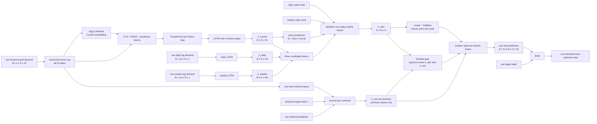

# another_model + main 통합 모델 설계안

## 1. 최종 목표

`another_model`을 backbone으로 유지하고, main 모델에서는 `daily`와 `weekly` demand
branch만 가져온다. main 모델의 `recent_encoder`는 제거한다. 단, another_model neural
branch가 사용하는 `(t-k, t-1)` local history는 유지한다.

최종 모델은 하나의 `UnifiedDemandModel(nn.Module)`로 구성한다. daily, weekly, another
neural branch는 이 모델 내부에서 attention으로 결합하고, retrieval branch는 another_model의
기존 결합 방식처럼 neural prediction과 raw retrieval prediction을 node별 gate로 결합한다.

- main recent branch: **제거**
- another local history: **유지**
- main daily branch: 사용
- main weekly branch: 사용
- attention 후보: `daily`, `weekly`, `h_neural` 세 branch
- attention query: `h_neural`
- retrieval search query: raw local demand window 유지
- weather: **사용함** — 정규화한 3값(기온/강수/적설)을 요일(7차원)·시간대(5차원) 임베딩과 함께
  세 LSTM 입력에 concat(총 15차원). 날씨는 임베딩하지 않는다.
- normalization: another_model 형식의 `log1p` 기반 입력
- retrieval value: raw demand 사용
- 최종 loss: **MAE만 사용**
- optimizer, forward, checkpoint: 하나

## 2. 최종 채택 구조 Mermaid



## 3. Attention 설계

daily와 weekly만 attention하는 것이 아니라, `h_neural`도 query와 후보 key/value에 모두
넣는다. 따라서 모델은 세 representation 중 현재 node와 target time에 더 유용한 branch의
영향력을 스스로 선택한다.

```text
h_neural = AnotherNeuralEncoder(raw_local_history)       # [B, N, Hn]
h_daily  = DailyEncoder(raw_daily_demand, daily_mask)    # [B, N, Hd]
h_weekly = WeeklyEncoder(raw_weekly_demand, weekly_mask) # [B, N, Hw]

z_neural = ProjNeural(h_neural)                          # [B, N, H]
z_daily  = ProjDaily(h_daily)                            # [B, N, H]
z_weekly = ProjWeekly(h_weekly)                          # [B, N, H]

candidates = stack([z_daily, z_weekly, z_neural], dim=2) # [B, N, 3, H]
query = Wq(z_neural).unsqueeze(2)                       # [B, N, 1, H]
keys = Wk(candidates)                                    # [B, N, 3, H]
values = Wv(candidates)                                  # [B, N, 3, H]

weights = softmax(query @ keys.transpose(-1, -2) / sqrt(H), dim=-1)
h_attn = LayerNorm(z_neural + weights @ values)          # [B, N, H]
```

`weights[..., 0]`, `weights[..., 1]`, `weights[..., 2]`는 각각 daily, weekly, neural의
node별 선택 비중으로 기록한다. `z_neural` residual은 학습 초기에 neural branch의 정보가
사라지는 것을 막기 위한 안정화 경로이며, attention의 선택 후보에는 세 branch가 모두 들어간다.

attention은 node 축을 섞지 않고 각 node의 세 branch token 축 `3`에 대해서만 수행한다. 따라서
의도하지 않은 node 간 global mixing이 발생하지 않는다.

## 4. another neural branch

원격 `ir` branch의 neural backbone을 그대로 사용한다. 해당 저장소의 기본 branch는 사용자가
말한 `main`이 아니라 `ir`이며, Dataset은 `demands`, `labels`, `sample_idx`를 반환한다.
[remote repository ir branch](https://github.com/dev-jake-kim/demandprediction/tree/ir)

```text
raw local history [B, k, H, W]
 -> vectorized local crop [B, k, N, (2a+1)^2]
 -> log1p
 -> FourierScalarEmbedding
 -> CLS + node embedding + EDGE + positional embedding
 -> TransformerEncoder per history step
 -> CLS output
 -> LSTM over k steps
 -> h_neural [B, N, Hn]
```

원격 구현은 local crop을 Transformer에 넣고 LSTM의 마지막 hidden에서 neural prediction을
생성한다. 통합 모델에서는 이 hidden을 attention에 연결하되, neural prediction은 아래 최종
gate에 사용할 내부 branch 출력으로만 만든다. [remote modeling.py](https://github.com/dev-jake-kim/demandprediction/blob/ir/models/modeling.py)

## 5. main daily/weekly branch

main의 `daily_encoder`와 `weekly_encoder`만 사용한다. `recent_encoder`, 최근 8시간 입력,
recent hidden을 query로 사용하는 기존 fusion은 이식하지 않는다.

```text
h_daily  = DailyLSTM(raw_daily_demand, daily_mask)
h_weekly = WeeklyLSTM(raw_weekly_demand, weekly_mask)
```

입력 lag 구성은 현재 main 데이터 계약을 따른다.

- daily: 같은 시각의 과거 daily lag 6개와 유효성 mask
- weekly: 같은 시각의 과거 weekly lag 4개와 유효성 mask
- `lag_radius`, `interval_min`, causal source time은 기존 main 전처리 규칙 유지

단, main 코드에 있는 daily/weekly attention query는 recent hidden을 사용하므로 기존
`N2MSDWGateTarget`를 그대로 재사용할 수 없다. daily/weekly LSTM encoder와 lag mask 처리만
재사용하고, 세 후보 attention은 통합 모델에서 새로 구성한다.

## 6. Invalid lag mask 처리

invalid lag는 0으로 채운 정상 수요로 취급하면 안 된다. mask는 LSTM 입력과 세 후보
attention에 모두 반영한다.

1. daily/weekly lag sequence에서 valid 위치만 chronological order로 compact한다.
2. `pack_padded_sequence` 또는 동일한 masked recurrent 처리로 LSTM에 넣는다.
3. branch에 valid lag가 하나도 없으면 해당 branch hidden을 zero로 반환하고
   `daily_valid`, `weekly_valid`를 false로 반환한다.
4. attention score에서 invalid daily/weekly token은 `-inf`로 mask한다.
5. daily와 weekly가 모두 invalid이면 neural token만 유효한 후보가 되어 attention weight가
   neural에 1로 가도록 한다.

```text
candidate_mask = [daily_valid, weekly_valid, True]
attention_scores[invalid candidate] = -inf
weights = softmax(attention_scores, dim=branch)
```

이렇게 해야 학습 초기 구간에서 padding 값이나 임의의 LSTM hidden이 periodic branch로
선택되지 않는다.

## 7. Retrieval branch와 최종 결합

retrieval의 검색 query는 attention query와 별개다. `h_neural`을 attention query로 사용하되,
retrieval 검색에는 원격 구현과 같은 raw local window query를 사용한다. 검색 DB의 key 순서와
forward query의 flatten 순서가 반드시 같아야 한다.

원격 구현은 cosine similarity가 높은 과거 top-k를 찾고, similarity softmax로 과거 실제
수요값을 가중평균해 `ir_out`을 만든다. [remote modeling.py](https://github.com/dev-jake-kim/demandprediction/blob/ir/models/modeling.py)

통합 모델의 최종 결합은 another_model의 기존 두 branch 결합 형식을 유지한다.

```text
neural_pred = Softplus(NeuralHead(h_attn))             # raw demand scale, [B, N]
ir_out = CausalRetrieval(raw_local_window, sample_idx) # raw demand scale, [B, N]

lambda = sigmoid(Gate([h_attn, ir_out]))                # [B, N]
prediction = lambda * neural_pred + (1 - lambda) * ir_out
```

이 결합은 두 개의 독립 모델을 따로 학습하는 앙상블이 아니다. 두 branch와 gate는 하나의
`UnifiedDemandModel` 안에 있고, 최종 prediction에 대해 하나의 MAE를 계산하며 하나의
optimizer로 end-to-end 학습한다. retrieval의 top-k index 선택 자체는 비미분 연산이므로
gradient는 neural branch, gate, head로 전달되고 검색 index/database는 고정된 causal artifact다.

## 8. Retrieval DB 시간 범위

기본 정책은 예측 시점 `t`보다 이전에 실제로 관측된 수요만 후보로 사용하는 것이다.

```text
candidate_times = [time_step, t)
```

여기서 `t`는 포함하지 않는다. 따라서 현재 target과 같은 시점의 label이나 미래 label은
검색되지 않는다. `sample_idx`는 split-local index가 아니라 원본 temporal grid 기준 절대
시간 인덱스여야 한다.

- 기본 모드: sequential observed-past — `tau < t`인 이전 관측값을 사용
- strict 모드: train-prefix-only — `tau < min(t, train_end)`만 사용

기본 모드는 실제 운영처럼 validation/test 시점 이전 수요가 관측되어 있다고 가정한다. test
구간의 과거 ground truth를 사용할 수 없는 평가 환경이면 strict train-prefix-only 모드로
전환한다. 어느 모드인지 결과 보고서에 반드시 기록한다.

검색 DB의 `retrieval_values`와 최종 `ir_out`은 raw demand 단위로 유지한다. 검색 query도
raw local window에서 만들고, neural branch와 daily/weekly branch의 입력 변환과 섞지 않는다.
원격 모델의 DB 구조는 node별 key, value, norm을 저장하고 후보를 `[time_step, t)`로
제한한다. [remote dataset](https://github.com/dev-jake-kim/demandprediction/blob/ir/dataset_frame/grid_demand_dataset.py)

## 9. Normalization과 출력 scale

통합 모델은 main의 현재 `train_max` 기반 입력 정규화를 복사하지 않고 another_model의 입력
형식을 기준으로 한다.

- local neural input: raw non-negative demand → `log1p` → Fourier embedding
- daily input: raw daily demand → `log1p` → daily LSTM
- weekly input: raw weekly demand → `log1p` → weekly LSTM
- retrieval query: raw local window
- retrieval value: raw demand
- label: raw demand
- neural prediction: `Softplus` raw demand scale
- final loss: raw scale MAE

따라서 unified Dataset은 daily/weekly lag를 train-max로 미리 나누지 않고 raw 값과 mask를
반환해야 한다. raw 값과 target의 단위가 같아야 마지막 `neural_pred`와 `ir_out`을 gate로
결합할 수 있다.

## 10. 데이터 계약

다른 비교 모델과 같은 `comparison_models/data` 아래의 temporal grid를 공통 원천으로 사용한다.
weather CSV(cp949, 기온/강수량/적설)도 함께 읽으며, 경로는 `datasets.<name>.weather_path`로
지정한다. 정규화 통계는 train split(`[time_step, train_end)`)에서만 계산한다.

```text
data/
├── ulsan/
│   └── ulsan_temporal_grid.npy
└── prtu/
    └── porto_temporal_grid.npy
```

Dataset은 하나의 target time `t`에 대해 다음 batch를 반환한다.

```text
demand_history: B x k x H x W       # another neural/retrieval용 raw history
daily_demand:  B x Ld x N x 1       # raw lag values
daily_mask:    B x Ld               # True means invalid
weekly_demand: B x Lw x N x 1       # raw lag values
weekly_mask:   B x Lw               # True means invalid
target:        B x H x W             # raw label
sample_idx:    B                   # absolute target time t
```

`N = H x W`이고 node order는 temporal grid의 row-major flatten 순서로 고정한다. Ulsan은
`14 x 12 = 168`, Porto는 `10 x 20 = 200` node다. legacy 43-node artifact나 merged
cluster `Q/P` mapping은 사용하지 않는다.

## 11. Loss와 학습 단위

통합 모델의 loss는 MAE 하나다.

```text
loss = mean(abs(prediction - target))
```

사용하지 않는다.

- another_model의 `CombinedLoss`
- MSE 또는 상대 오차 제곱 항
- branch별 optimizer
- branch별 backward
- main recent branch

학습 단위는 다음과 같다.

```text
one UnifiedDemandModel
 -> one forward
 -> neural attention + retrieval gate
 -> one final prediction
 -> one MAE
 -> one backward
 -> one optimizer step
```

## 12. 구현 순서

1. 공통 temporal grid에서 raw history, daily/weekly lag, invalid mask, absolute `sample_idx`
   를 반환하는 `UnifiedDataset`을 만든다.
2. another neural branch의 `output_proj` 전 hidden을 반환하도록 분리한다.
3. main의 daily/weekly LSTM과 causal lag/mask 전처리만 이식한다.
4. `h_neural`을 query로 하고 `[h_daily, h_weekly, h_neural]`을 key/value로 하는 branch
   attention을 구현한다.
5. invalid daily/weekly token mask와 all-invalid fallback을 추가한다.
6. attention 결과에 neural prediction head를 연결한다.
7. 원격 구현과 같은 raw local retrieval 및 `tau < t` 후보 제한을 연결한다.
8. `neural_pred`와 raw `ir_out`을 another_model 형식의 node-wise lambda gate로 결합한다.
9. `CombinedLoss` 대신 raw target 기준 MAE를 연결한다.
10. Ulsan/Porto에서 shape, finite value, non-negative output, causal retrieval, invalid mask,
    세 branch attention weight, gradient 전달을 검증한다.

## 13. 반드시 확인할 미확정 사항

- test 시점에 이전 test ground truth를 관측값으로 사용할 수 있는지: observed-past와
  train-prefix-only 중 최종 평가 모드 결정
- `k`, `a`, `d_model`, `fusion_dim`의 최종값: 초기값은 another_model의 `k=24`, `a=2`,
  `d_model=64`, 공통 `fusion_dim=128`으로 시작
- daily/weekly lag의 `lag_radius`: 현재 main 설정 `0`을 기본으로 유지할지 검증
- raw demand의 최대값이 큰 dataset에서 `log1p` 후 Fourier 주파수 학습이 안정적인지 확인
- retrieval 후보가 부족한 초기 target: 유효 후보가 없으면 `ir_out=0`으로 두고 lambda가
  neural branch를 선택하도록 할지, 첫 유효 시점 이후부터 Dataset sample을 시작할지 결정
- retrieval DB를 checkpoint에 저장하지 않고 모델 생성/로드 후 CPU에서 재구성하는 정책 유지

현재 설계에서 가장 중요한 계약은 다음 세 가지다.

```text
attention query = h_neural
attention candidates = daily, weekly, h_neural
retrieval query = raw local history, candidate time < target time
```
